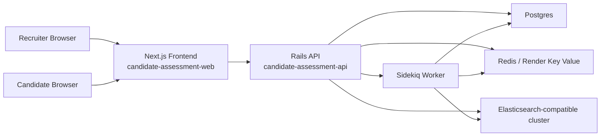

# Candidate Assessment API

Multi-tenant Rails API backend for a candidate assessment platform. This repository owns the recruiter and candidate backend workflows, tenant isolation, async result processing with Sidekiq, and Elasticsearch-backed search. The frontend now lives separately at `/Users/tusharr/Desktop/projects/candidate-assessment-web`.

## Architecture



## Repository Layout

- `app/`: Rails domain models, controllers, policies, jobs, and serializers
- `docs/openapi.yaml`: OpenAPI 3.0 contract for the API
- `docs/adr/001-system-design.md`: System design ADR
- `docker-compose.yml`: Local backend infrastructure plus optional sibling frontend wiring
- `render.yaml`: Render blueprint for API, worker, Redis, and Postgres

## Product Coverage

- Strict tenant isolation with row-level organization scoping, Pundit policies, scoped queries, job-time tenant restoration, and tenant-safe Elasticsearch filters
- Assessment lifecycle with `draft`, `published`, and `archived` states
- Single-use invitation links with expiry and candidate binding
- Timed candidate sessions with autosave, server-side time checks, idempotent final submit, and no second attempt
- Async result processing via Sidekiq for submission finalization, scoring, aggregation, dashboard refresh, and Elasticsearch indexing
- Recruiter dashboard stats, assessment performance metrics, result drill-down, manual review, and text search

## Local Setup

### Prerequisites

- Ruby `3.2.2`
- Node.js `20+`
- PostgreSQL `16+`
- Redis `7+`
- Elasticsearch `8+`

### Environment

Copy `.env.example` into your preferred local env mechanism and update secrets:

```bash
cp .env.example .env
```

Important variables:

- `DATABASE_URL`
- `REDIS_URL`
- `ELASTICSEARCH_URL`
- `ELASTICSEARCH_INDEX_NAME`
- `DEVISE_JWT_SECRET_KEY`
- `SECRET_KEY_BASE`
- `FRONTEND_URL`

### Manual Boot

```bash
./bin/setup
bundle exec rails server -p 3001
bundle exec sidekiq -C config/sidekiq.yml
cd ../candidate-assessment-web && npm install && npm run dev
```

## Docker

Bring up the full stack:

```bash
docker-compose up --build
```

Services:

- Frontend: `http://localhost:3000`
- Backend API: `http://localhost:3001/api/v1`
- Postgres: `localhost:5432`
- Redis: `localhost:6379`
- Elasticsearch: `http://localhost:9200`

The backend repo’s Compose file expects the sibling frontend project at `../candidate-assessment-web`.

## Render Deployment

### Services

- `candidate-assessment-api`: Rails web service
- `candidate-assessment-api-worker`: Sidekiq background worker
- `candidate-assessment-postgres`: managed Postgres
- `candidate-assessment-redis`: Render Key Value

### Deploy Steps

1. Push this backend repository to GitHub.
2. In Render, create a new Blueprint from this repo’s `render.yaml`.
3. Provide values for:
   - `FRONTEND_URL`
   - `ELASTICSEARCH_URL`
4. Confirm the Postgres and Key Value resources.
5. Deploy the Blueprint.
6. Deploy `candidate-assessment-web` separately from `/Users/tusharr/Desktop/projects/candidate-assessment-web`.
7. After the first API deploy, run:

```bash
bundle exec rails elasticsearch:create_indices
bundle exec rails elasticsearch:reindex
```

### Free-Tier Note

The API web service, Postgres, and Key Value resources are configured for free-tier-friendly sizing. The Sidekiq worker is intentionally set to the smallest paid worker plan in `render.yaml` because Render does not currently provide a free instance type for background workers. The frontend should be deployed separately on its own free web service.

### Hosted Elasticsearch

Render does not provide a managed Elasticsearch service in this blueprint. Set `ELASTICSEARCH_URL` to a hosted Elasticsearch-compatible service such as Bonsai or Elastic Cloud.

## API Contract

- OpenAPI spec: [`docs/openapi.yaml`](/Users/tusharr/Desktop/projects/candidate-assessment-api/docs/openapi.yaml)
- ADR: [`docs/adr/001-system-design.md`](/Users/tusharr/Desktop/projects/candidate-assessment-api/docs/adr/001-system-design.md)

## Seed Data

Local seeds create:

- Organization: `Demo Corp`
- Recruiter: `admin@demo.com`
- Password: `password123`

Run:

```bash
bundle exec rails db:seed
```

## Deployment Optimizations

- Sidekiq concurrency defaults to `2`
- Puma thread count defaults to `3`
- Elasticsearch reindexing batches in chunks of `100`
- Dashboard search returns a safe unavailable response when Elasticsearch is down
- Frontend and backend are deployed independently for lower memory pressure
